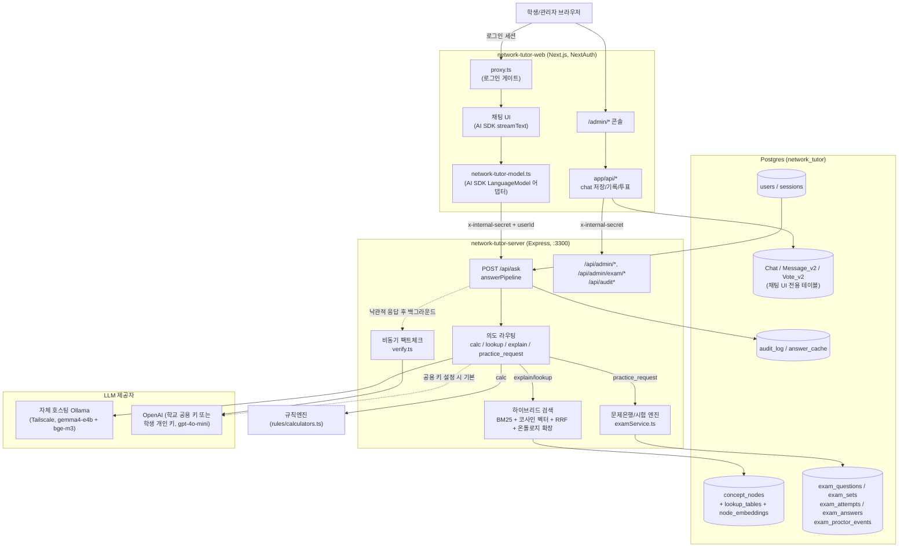

# classnet.chat — 네트워크관리사 2급 AI 튜터

네트워크관리사 2급 필기시험을 준비하는 실제 학교 파일럿을 위해 만든 AI 튜터 서비스. 연구용 데모가
아니라 매일 학생이 쓰는 실서비스라는 전제로 설계되었다 — "모른다"고 답을 회피하는 대신 근거를 최우선으로
쓰되 필요하면 배경지식으로 답하고, 검증에서 우려가 표시돼도 응답 자체는 지연 없이 먼저 내보낸다.

**운영 환경**: 학생 앱 `https://classnet.chat`, 관리자 콘솔 `https://admin.classnet.chat` (같은
Next.js 앱의 `/admin/*` 라우트).

## 구성

| 디렉토리 | 역할 | 스택 |
|---|---|---|
| [`network-tutor-server/`](network-tutor-server) | RAG 답변 파이프라인, 계산 규칙엔진, 문제은행/시험 엔진, 관리자·감사 API — 모든 `/api/*` | Node.js, Express, `pg`, zod 없음(수동 검증) |
| [`network-tutor-web/`](network-tutor-web) | 학생/관리자가 보는 웹 UI — [vercel/chatbot](https://github.com/vercel/chatbot) 템플릿을 포크해 채팅 배관(스트리밍, 사이드바 기록)만 재사용하고 실제 두뇌는 백엔드로 위임 | Next.js 16, React 19, NextAuth, Drizzle ORM, AI SDK |

두 서비스는 완전히 다른 인증 체계(Express 자체 쿠키 세션 vs NextAuth JWT)를 가진 별개 프로세스이며,
서버 간 호출은 `x-internal-secret` 헤더(양쪽 `.env`에 동일하게 설정된 `INTERNAL_API_SECRET`)로
신뢰한다 — 이 헤더는 브라우저에는 절대 노출되지 않는다.

## 아키텍처



**핵심 설계 포인트**

- **회피하지 않는다**: 컨텍스트에 없어도 배경지식으로 답하되 `[AI 배경지식]`으로 라벨링한다. "모른다"고
  답을 거부하는 순수 RAG 정책은 이 프로젝트에서는 실패로 간주된다 — [[production-ai-answer-policy]]와
  같은 원칙.
- **검증은 응답을 막지 않는다**: 팩트체크(`verifyGroundedness`, LLM 호출로 ~2~4초)가 끝나길 기다렸다가
  응답하면 매 질문마다 생성+검증 두 번의 LLM 호출을 순차 대기하게 되어 체감 지연이 컸다. 지금은 생성이
  끝나는 즉시 답을 보내고, 검증은 응답 전송 후 백그라운드에서 `audit_log`를 갱신한다.
- **문제는 지어내지 않는다**: "비슷한 문제 줘" 같은 연습 요청은 절대 그 자리에서 AI가 창작하지 않고,
  이미 검수·승인된 문제은행(`exam_questions`, `status='approved'`)에서만 찾는다. 문제은행에 정말 없을
  때만 최후 수단으로 AI가 새로 만들고, 그마저도 별도의 신선한 LLM 호출로 팩트체크를 통과해야만 노출된다
  (자기 확신 반복을 피하기 위해 생성과 검증을 같은 호출 안에서 하지 않는다).
- **세 갈래 검증 전략**: 계산형(`verifyCalcAnswer`)은 규칙엔진이 낸 숫자 집합과 LLM 서술을 대조하고,
  조회형(`verifyStructuredAnswer`)은 표 데이터 포함 여부를 대조하며, 설명형(`verifyGroundedness`)은
  LLM 팩트체커에게 "암기하면 시험에서 틀릴 만큼 잘못됐는가"만 판정시킨다(실패 시 어휘 중첩 휴리스틱으로
  안전하게 폴백). 세 검증 모두 "컨텍스트 밖 내용 = 결함"이 아니라 "명백한 사실 오류만 결함"이라는 같은
  정책을 공유한다.
- **개인화는 자기소개가 아니라 채점 결과 기반**: `pipeline/personalization.ts`가 학생이 실제로 풀고
  틀린 문제(`exam_answers`)를 과목/세부주제 단위로 집계해 취약 영역을 찾고, `audit_log`에 쌓인 질문
  이력에서 최근 30일 관심 주제를 뽑아 모든 답변 프롬프트에 반영한다 — 캐시 키에도 이 성향 태그가 섞여
  같은 질문이라도 학생별로 다른 캐시를 쓴다.
- **Next.js 앱은 두뇌가 없다**: `lib/ai/network-tutor-model.ts`는 AI SDK의 `LanguageModel` 인터페이스를
  흉내내는 얇은 어댑터일 뿐, 실제 판단(검색·검증·개인화)은 전부 `network-tutor-server`가 한다. 이렇게
  분리한 이유는 템플릿이 이미 갖춘 스트리밍/채팅저장/사이드바 배관을 그대로 재사용하기 위함이다.

## 답변 파이프라인 (`network-tutor-server/src/pipeline`, `router`, `search`)

`POST /api/ask` → `answerQuestion()`이 매 요청마다:

1. **개인화 신호 조회** (`personalization.ts`) — 취약 과목/주제, 최근 관심 주제를 한 번만 조회해 이후
   모든 갈래가 공유.
2. **연습 요청 감지** (`practiceRequestExtractor.ts`) — 정규식 기반. 보기 마커(①②③④)가 있거나
   메시지가 길면(붙여넣은 실제 문제 지문) 오탐으로 보고 건너뛴다.
3. **캐시 조회** (`cache.ts`) — 이미지 질문·꼬리질문(히스토리 포함)은 캐시 대상에서 제외(같은 텍스트라도
   맥락에 따라 답이 달라져야 하므로). 캐시 키는 `질문+수준+개인화태그`의 SHA-256.
4. **계산 요청 추출** (`router/calcExtractor.ts`) — 서브넷/서브넷 분할/IP 클래스 판별/진법 변환/섀넌·
   나이키스트 대역폭 계산을 정규식으로 감지해 `rules/calculators.ts`가 실제 계산을 수행(LLM은 결과를
   자연어로 풀어 설명만 함).
5. 위 셋 다 아니면 **하이브리드 검색** (`search/hybridSearch.ts`): BM25(`textIndex.ts`, 한글은 2-gram
   토크나이저) + 코사인 유사도 벡터 검색(`vectorIndex.ts`, Ollama `bge-m3` 임베딩)을 Reciprocal Rank
   Fusion(k=60)으로 합치고, 최상위 노드 기준 온톨로지 1-hop 인접 개념까지 확장(`getSiblings`)한다.
   - 검색 결과가 표(`lookup_tables`)의 특정 행에 정확히 걸리면 **조회형**(`lookupSearch.ts`)으로 분기 —
     단, 여러 문제가 붙여넣기된 것으로 보이면(CIDR 프리픽스가 표의 숫자와 우연히 겹치는 등의 오탐을
     막기 위해) 이 지름길을 건너뛰고 일반 설명으로 보낸다.
   - 아니면 **설명형**으로 검색된 컨텍스트 + 표 데이터를 프롬프트에 조립(`context.ts`)해 LLM 호출.
6. **감사 로그 기록** (`audit.ts`) — 모든 답변은 `audit_log`에 질문·검색된 노드·규칙엔진 트레이스·검증
   상태·최종 답변을 남긴다. 설명형은 낙관적으로 `verified`를 먼저 쓰고, 백그라운드 검증이 끝나면 같은
   행을 갱신한다.

라우팅에서 실사용 중 발견된 흥미로운 버그들이 소스 주석에 남아 있다 — 예: 꼬리질문("어느 단원이야?")의
검색어가 비어 무관한 컨텍스트를 끌어온 문제, CIDR "/21"이 FTP 포트 표의 "21"과 우연히 겹쳐 8문제 해설
요청이 표 한 줄 답으로 축소된 문제, "OSPF는 벨먼-포드"처럼 AI가 그 자리에서 지어낸 문제의 알고리즘이
뒤바뀐 사고 등. 각 수정은 왜 그렇게 했는지 주석으로 근거가 남아있으니 관련 로직을 다시 만질 때는
`answerPipeline.ts`/`practiceRequestExtractor.ts`/`lookupSearch.ts`의 주석을 먼저 읽는 것을 권장한다.

## 문제은행 / 시험 엔진 (`exam/`, `routes/exam.ts`, `routes/adminExam.ts`)

- **문제 출처 3종** (`exam_questions.source`): `ai_generated`(교재 근거+규칙엔진 재검증+교사 승인),
  `admin_authored`(교사 직접 출제), `past_exam`(실제 기출 — CSV로 수집해 `ingestPastExam.ts`로 적재,
  해설은 `enrichPastExamExplanations.ts`가 배치로 채움). 관리자 승인(`status='approved'`)을 거치지
  않은 문제는 절대 학생에게 노출되지 않는다.
- **응시 종류 4가지** (`exam_sets.kind`): `mock`(실제 시험 과목 배분 10/17/18/5=50문항, 60분 자동
  구성), `admin_timed`(교사가 고정 문항·시간으로 출제, 예약 시작/종료 지원), `practice_custom`(개인
  맞춤 연습, 채팅에서 바로 만들어짐), `past_exam_round`(실제 기출 회차를 원본 순서 그대로 재현).
- **부정행위 방지**: 응시마다 문항 순서와 보기 순서를 학생별로 셔플해 스냅샷 저장(`choice_order`) —
  같은 시험이라도 옆 사람과 화면이 다르다. 브라우저에서 관찰 가능한 이상 신호(탭 전환, 전체화면 이탈,
  개발자도구, 복사/붙여넣기)를 `exam_proctor_events`에 기록하고, 누적 3회부터 교사 검토 대상으로
  플래그, 8회부터는 자동 제출 — 완전한 부정행위 차단(웹캠 감독 등)은 명시적으로 범위 밖.
- **채점**: 객관식/단답식은 제출 즉시 자동 채점. 주관식/서술형은 정답이 하나가 아니므로 자동채점하지
  않고 `admin/exams` 채점 큐에서 교사가 직접 점수·피드백을 남긴다.
- **응시 취소 후 재조회**: `getAttemptResults`로 이미 제출된 응시를 상태 변경 없이 다시 열람 가능
  (오답노트/문제 해설 다시보기).

## 하이브리드 검색 + 온톨로지 (`search/`)

- `concept_nodes` 152개(온톨로지 노드=RAG 청크 단위), `lookup_tables`(표 데이터, JSONB), `node_embeddings`
  (`bge-m3` 벡터, pgvector 없이 JSONB로 저장하고 애플리케이션 레벨 코사인 유사도로 검색 — 코퍼스가
  152노드로 작아 인덱스형 벡터 검색이 필요 없다고 판단).
- BM25: 형태소 분석기 없이 영숫자는 단어 단위, 한글은 2-gram으로 토크나이즈하는 경량 구현
  (`textIndex.ts`).
- RRF(k=60)로 BM25 순위와 벡터 순위를 합친 뒤, 최상위 노드의 `tag_path` 기준 형제 노드를 온톨로지
  1-hop만큼 추가로 끌어와 컨텍스트를 보강한다.

## 인증 모델

두 서비스가 서로 다른 인증 체계를 쓰고, 세 가지 신뢰 경로가 공존한다:

1. **학생/관리자 → network-tutor-web**: NextAuth Credentials 프로바이더. 학생은 학번, 관리자는 학교
   이메일로 로그인 — 자격 종류와 역할이 어긋나면 거부(`auth.ts`). 계정 없음/틀린 비밀번호 모두 더미
   해시 비교로 같은 시간이 걸리게 해 타이밍 공격을 막는다.
2. **network-tutor-web → network-tutor-server**: 서버 간 신뢰 호출. `x-internal-secret` 헤더 +
   `userId`(GET은 쿼리스트링, 나머지는 body)로 사용자를 직접 식별 — 브라우저는 이 시크릿을 절대 보지
   못한다(`lib/backend.ts`, `lib/adminBackend.ts` ↔ `auth/middleware.ts`의 `attachUser`).
3. **학생 브라우저 → network-tutor-server (레거시/직접 접근)**: Express 자체 쿠키 세션
   (`ntutor_session`, 30일 TTL, `sessions` 테이블). `attachUser`가 내부 시크릿 헤더가 없으면 이 쿠키로
   폴백한다.

nginx가 TLS를 종료하고 백엔드에는 평문 HTTP로 전달하는 배포 구조에서 겪은 두 가지 실제 버그(문서화된
교훈, `proxy.ts` 주석):
- `getToken()`의 `secureCookie` 자동판단이 `request.nextUrl.protocol`을 보는데 이게 항상 `http:`로
  읽혀 `__Secure-` 쿠키를 못 찾음 → nginx가 보내주는 `x-forwarded-proto`를 직접 읽어 명시적으로 판단.
- nginx 경로 프리픽스 재작성이 이미 그 프리픽스 아래 사는 Next.js 실제 라우트(`/admin/*`)와 충돌해
  이중 프리픽스(`/admin/admin`)가 생김 → 프리픽스 재작성 없이 투명 프록시로 전환.

## 데이터베이스 스키마

**network-tutor-server가 소유** (`src/db/schema.sql`):

```
concept_nodes ──< lookup_tables         (표 데이터, JSONB)
concept_nodes ──< node_embeddings        (bge-m3 벡터, JSONB)

users ──< sessions                       (Express 쿠키 세션)
users ──< audit_log                      (모든 질문/답변/검증 이력)
         answer_cache                    (질문+수준+개인화태그 → 캐시)

exam_questions ──< exam_sets(question_ids 배열로 참조)
exam_sets ──< exam_attempts ──< exam_answers
exam_attempts ──< exam_proctor_events

users ──< bookmarks >── concept_nodes
app_settings                             (key-value, 시험일 등)
users ── student_report_analysis         (AI 종합 리포트 캐시)
```

**network-tutor-web이 소유** (`lib/db/schema.ts`, 채팅 UI 전용 — vercel/chatbot 템플릿에서 계승):
`Chat`, `Message_v2`, `Vote_v2`, `Document`, `Suggestion`, `Stream`. 별도 `User` 테이블은 없고
`network-tutor-server`의 정수 `users.id`를 문자열로만 참조한다 — 계정의 단일 진실 공급원은 항상
백엔드 쪽 `users` 테이블이다.

## API 라우트 전체 목록 (`network-tutor-server/src/routes`)

<details>
<summary>펼치기 — 학생용 (auth / ask / calc / lookup / bookmarks / exam / ontology / settings)</summary>

```
POST   /api/auth/login
POST   /api/auth/logout
GET    /api/auth/me
POST   /api/auth/change-password
PATCH  /api/me/profile
PUT    /api/me/openai-key
DELETE /api/me/openai-key

POST   /api/ask

POST   /api/calc/subnet
POST   /api/calc/ip-class
POST   /api/calc/base-convert
POST   /api/calc/channel-capacity

POST   /api/problem/explain

GET    /api/lookup/tables
GET    /api/lookup/tables/:tableName

GET    /api/bookmarks
POST   /api/bookmarks/:nodeId
DELETE /api/bookmarks/:nodeId

GET    /api/ontology/tree
GET    /api/ontology/node/:id

GET    /api/exam/recommended-topic
GET    /api/exam/bank
POST   /api/exam/bank/:id/start
POST   /api/exam/concept/:nodeId/practice-start
GET    /api/exam/meta
POST   /api/exam/practice/start
POST   /api/exam/mock/start
GET    /api/exam/rounds
POST   /api/exam/round/:roundLabel/start
GET    /api/exam/timed
POST   /api/exam/timed/:examSetId/start
GET    /api/exam/attempts
GET    /api/exam/attempts/:id
POST   /api/exam/attempts/:id/answer
POST   /api/exam/attempts/:id/submit
POST   /api/exam/attempts/:id/proctor-event
GET    /api/exam/wrong-answers
POST   /api/exam/wrong-answers/retry-all
GET    /api/exam/my-report
GET    /api/exam/my-report/analysis
POST   /api/exam/my-report/analysis/regenerate
GET    /api/exam/questions/:id/explain

POST   /api/audit/:id/report

GET    /api/settings/exam-date
```
</details>

<details>
<summary>펼치기 — 관리자용 (admin / adminExam / audit)</summary>

```
GET    /api/admin/analytics/overview
GET    /api/admin/analytics/ranking
POST   /api/admin/users
POST   /api/admin/users/bulk-csv
GET    /api/admin/users
GET    /api/admin/users/:id
GET    /api/admin/users/:id/history
PATCH  /api/admin/users/:id/pre-test-score
PATCH  /api/admin/users/:id/post-test-score
POST   /api/admin/users/:id/reset-password
DELETE /api/admin/users/:id
POST   /api/admin/settings/exam-date

GET    /api/admin/exam/questions
GET    /api/admin/exam/questions/:id
POST   /api/admin/exam/questions
PATCH  /api/admin/exam/questions/:id
DELETE /api/admin/exam/questions/:id
POST   /api/admin/exam/questions/:id/approve
POST   /api/admin/exam/questions/:id/reject
GET    /api/admin/exam/stats
GET    /api/admin/exam/question-quality
POST   /api/admin/exam/sets
GET    /api/admin/exam/sets
POST   /api/admin/exam/sets/:id/publish
POST   /api/admin/exam/sets/:id/unpublish
PATCH  /api/admin/exam/sets/:id
GET    /api/admin/exam/grading-queue
POST   /api/admin/exam/answers/:id/grade
GET    /api/admin/exam/attempts-export
GET    /api/admin/exam/attempts
GET    /api/admin/exam/attempts/:id/proctor-events
POST   /api/admin/exam/attempts/:id/invalidate

GET    /api/audit               (전체 목록)
GET    /api/audit/:id
POST   /api/audit/:id/review
GET    /api/audit-summary/stats
```
</details>

network-tutor-web은 이 라우트들을 직접 노출하지 않고, `app/api/admin/[[...path]]/route.ts`와
`app/api/audit/[[...path]]/route.ts`가 세션을 확인한 뒤 그대로 프록시한다 — 관리자 콘솔은 브라우저
입장에서는 자기 자신의 API만 호출하는 것처럼 보인다.

## 프론트엔드 구조 (`network-tutor-web`)

- **채팅 UI**: vercel/chatbot 템플릿의 스트리밍/사이드바 기록/아티팩트 배관을 그대로 쓰되, 실제 모델
  호출은 `lib/ai/network-tutor-model.ts`가 가로채 `network-tutor-server`로 위임. 인라인 연습문제
  카드는 스트림 텍스트 끝에 HTML 주석으로 감춘 마커(`<!--PRACTICE_ATTEMPT:{...}-->`)를 붙이고
  프론트가 파싱해 렌더링하는 방식 — 새 데이터 채널을 만들지 않고 기존 텍스트 스트림 배관 하나만
  재사용한다.
- **학생 페이지**: 채팅(`/`, `/chat/[id]`), 문제은행(`/question-bank`), 연습(`/practice`), 모의고사
  (`/mock-exam`), 시간제 시험(`/timed-exam`), 기출 회차(`/rounds`), 오답노트(`/wrong-answers`), 나의
  학습 리포트(`/my-report`), 플래시카드(`/flashcards`).
- **관리자 콘솔** (`/admin/*`): 대시보드, 문제 검수(`/admin/questions`), 시험 관리(`/admin/exams`),
  학생 관리(`/admin/students`), 랭킹(`/admin/ranking`), 감사 로그(`/admin/audit`) — 옛 Express 정적
  관리자 페이지는 완전히 제거되고 이 Next.js 콘솔로 통합되었다.
- **기출문제 이미지**: `public/exam-images/`에 실제 시험 지문 스캔 344장(2004~2026년 회차). 텍스트로
  옮기기 어려운 다이어그램·표가 포함된 문제에 `stem_image_url`로 연결된다.

## 환경변수

값은 각 디렉토리의 `.env`/`.env.local`(git에 커밋되지 않음)에 있다. 이름만 정리:

**`network-tutor-server/.env`**
`DATABASE_URL`, `PORT`, `OLLAMA_BASE_URL`, `OLLAMA_CHAT_MODEL`, `OLLAMA_EMBED_MODEL`,
`OLLAMA_MAX_CONCURRENT_CHAT`, `OLLAMA_MAX_CONCURRENT_EMBED`, `OPENAI_API_KEY`(선택 — 학교 공용 키),
`ENCRYPTION_KEY`(비어있으면 최초 실행 시 자동 생성되어 `.env`에 저장됨), `SESSION_SECRET`(동일),
`INTERNAL_API_SECRET`, `COOKIE_SECURE`, `COOKIE_DOMAIN`, `ADMIN_EMAIL`/`ADMIN_NAME`/`ADMIN_PASSWORD`
(`seedAdmin.ts` 최초 실행용)

**`network-tutor-web/.env.local`**
`AUTH_SECRET`, `AUTH_URL`, `AUTH_TRUST_HOST`, `POSTGRES_URL`(채팅 UI 전용 테이블), `BACKEND_API_URL`,
`INTERNAL_API_SECRET`, `NEXT_PUBLIC_BASE_PATH`, `PORT`

`INTERNAL_API_SECRET`은 두 서비스가 반드시 동일한 값을 가져야 한다.

## 로컬 개발

```bash
# 1) network-tutor-server
cd network-tutor-server
npm install
npm run migrate        # schema.sql 적용
npm run ingest         # 참조 데이터 → concept_nodes/lookup_tables/node_embeddings 적재 (별도 소스 필요)
tsx src/db/seedAdmin.ts   # 최초 관리자 계정 생성 (ADMIN_EMAIL/ADMIN_NAME/ADMIN_PASSWORD 필요)
npm run dev             # tsx watch, :3300

# 2) network-tutor-web
cd network-tutor-web
pnpm install
pnpm db:migrate          # Chat/Message_v2/... 테이블 (채팅 UI 전용)
pnpm dev                 # next dev --turbo, :3000
```

Ollama(자체 호스팅 `gemma4-e4b`/`bge-m3`)에 대한 네트워크 접근이 없으면 `OPENAI_API_KEY`를 설정해
OpenAI 경로로 대체 가능(`llm/provider.ts`가 자동으로 우선순위를 정함: 학생 개인 키 > 학교 공용 키 >
Ollama).

## 알아두면 좋은 설계 결정

- **동시성 제한이 실측 기반**: `config.ts`의 `OLLAMA_MAX_CONCURRENT_CHAT=3`은 실제 파이프라인(컨텍스트
  +대화이력+개인화 지시문이 붙어 6000~10000자에 달하는 프롬프트)으로 두 번 재측정해 얻은 보수적인
  값이다 — 짧은 프롬프트 벤치마크로 처음 잡았던 10은 실제 부하를 전혀 대표하지 못했다.
  `reasoningEffort: "low"`도 같은 이유(응답 시간 대부분이 검색이 아니라 생성 자체)로 설명형 답변에
  적용해 응답 시간을 7~10초에서 3~7초로 줄였다.
  - 대신 문제 해설/생성/검증처럼 정확도가 중요한 호출은 항상 상위 모델(`OPENAI_CHAT_MODEL_HIGH`)을
    명시적으로 지정한다 — 속도-정확도 트레이드오프를 호출 종류별로 다르게 가져간다.
- **토큰 버짓 관리**: `users.token_quota/token_used/token_remaining` — 학교 공용 OpenAI 키 사용량을
  학생별로 추적. `run_token_burn.ts`/`tmp_run_token_burn.ts`는 실제 API 호출 없이(또는 소량 호출로)
  감사 로그 레코드 수를 빠르게 늘리기 위한 테스트/부하 스크립트다.
- **past_exam 데이터의 출처를 정직하게 구분**: `exam_questions.source`가 `ai_generated`/`past_exam`을
  명확히 분리한다 — comcbt.com처럼 저작권 고지가 있는 사이트의 기출은 명시적으로 스크래핑을 거부한 적이
  있고(별도 세션 기록), 지금 적재된 344개 기출 이미지·문제는 CSV로 별도 수집된 것이다. 새로운 기출
  출처를 추가할 때는 이 `source` 필드와 `source_detail`(JSONB, 회차/문제번호 등 원본 메타데이터)의
  정직성 원칙을 유지할 것.
- **`config.ts`가 시크릿을 자동 생성**: `ENCRYPTION_KEY`/`SESSION_SECRET`이 없으면 최초 실행 시
  랜덤 생성해 `.env`에 append한다 — 재기동 시 값이 유지되어야 기존에 암호화된 학생 OpenAI 키를 복호화할
  수 있으므로, 이 파일을 실수로 초기화하지 않도록 주의.
